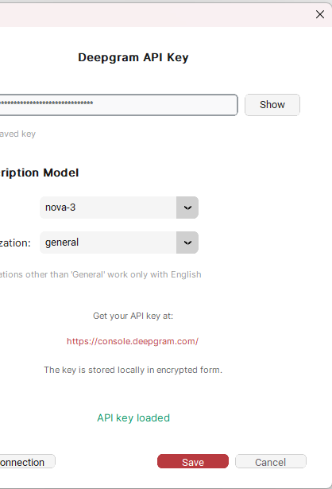

# Redscribe

Desktop application for batch transcription of audio and video files using Deepgram AI. Now with YouTube integration and automatic retry.


## Download

### Windows Installer

[](https://github.com/micple/redscribe/releases/latest/download/Redscribe-Setup-1.0.0.exe)

**[Download Redscribe-Setup-1.0.0.exe](https://github.com/micple/redscribe/releases/latest/download/Redscribe-Setup-1.0.0.exe)** (~107 MB)

> **Free credits:** Deepgram offers **$200 free credits** on signup - that's **50+ hours** of transcription!
> Get your API key at [console.deepgram.com](https://console.deepgram.com/)

## Features

- **Batch Processing** - Transcribe multiple audio/video files at once
- **Large Collections** - Optimized for directories with 2000+ files
- **YouTube Integration** - Download and transcribe audio from YouTube videos, playlists, and channels using yt-dlp
- **Multiple Formats** - Export to TXT, SRT, VTT (with timestamps)
- **Speaker Diarization** - Automatically detects and labels different speakers
- **Multi-language Support** - 12+ languages including Polish, English, German, French, Spanish, and more
- **Auto Language Detection** - Automatically detect language for each file
- **Video Support** - Automatic audio extraction from video files using FFmpeg
- **Model Selection** - Choose between Nova-2 and Nova-3 models with domain specializations
- **Automatic Retry** - Failed transcriptions are automatically retried with error classification (network, rate limit, server errors)
- **Session Logging** - Built-in Logs tab with event stream and session statistics
- **Progress Tracking** - Real-time progress with cancel option
  - Individual file status (pending → converting → transcribing → retrying → completed/failed)
  - File size display during processing
  - Manual retry button for failed files
  - Warning when closing during processing
- **Tabbed Interface** - Main, YouTube, and Logs tabs for organized workflow
- **Secure API Storage** - Encrypted API key storage

## Security

### API Key Protection
- **Encrypted storage** - API key is encrypted using Fernet with PBKDF2 key derivation (100,000 iterations)
- **Machine-bound encryption** - Uses unique machine identifier + random salt per installation
- **Restricted file permissions** - Config file is accessible only by the current user (chmod 600 on Unix, icacls on Windows)

### File Handling Security
- **Path traversal protection** - Validates paths against `../` attacks and symlink exploits
- **Memory-efficient uploads** - Large files (up to 2GB) are streamed in 64KB chunks
- **Secure temp files** - Temporary files have restricted permissions and are auto-cleaned on startup
- **Sanitized error messages** - FFmpeg errors don't expose system paths

## Screenshots

### Main Window


The main interface allows you to:
- Select a directory with media files
- Choose output format (TXT, SRT, VTT)
- Select transcription language or auto-detect
- Enable speaker diarization
- Configure output location
- Monitor your Deepgram credits balance

### Settings


Configure your Deepgram API:
- **API Key entry** - Enter your Deepgram API key
- **Show/Hide** - Toggle key visibility
- **Delete saved key** - Remove stored key from encrypted storage
- **Model selection** - Choose between Nova-2 and Nova-3
- **Specialization** - Select domain specialization (options depend on model)
- **Test Connection** - Verify API key before saving
- **Deepgram Console link** - Quick access to get your API key

### About Dialog
Click the info button in the bottom-right corner to view:
- Application version
- Feature summary
- Link to Deepgram website
- Author information

## Requirements

- **Windows 10/11**, **macOS 10.15+**, or **Linux** (Ubuntu 20.04+, etc.)
- Python 3.11+
- FFmpeg (for video conversion)
- Deepgram API key
- yt-dlp (included in dependencies, for YouTube downloads)

## Installation

### 1. Clone the repository

```bash
git clone https://github.com/micple/redscribe.git
cd redscribe
```

### 2. Install dependencies

```bash
pip install -r requirements.txt
```

### 3. Install FFmpeg

**Windows:**
```bash
# Using winget
winget install FFmpeg

# Or download from https://ffmpeg.org/download.html and add to PATH
```

**macOS:**
```bash
brew install ffmpeg
```

**Linux (Ubuntu/Debian):**
```bash
sudo apt update && sudo apt install ffmpeg
```

### 4. Get Deepgram API Key

1. Create an account at [console.deepgram.com](https://console.deepgram.com/)
2. Generate an API key
3. Enter the key in Settings within the app

## Usage

### Running the Application

```bash
python main.py
```

### Basic Workflow (Main Tab)

1. **Configure API** - Open Settings, enter your Deepgram API key, select model
2. **Select Directory** - Click "Browse" to select a folder with media files
3. **Choose Files** - Click "Files to transcribe" to select specific files
4. **Configure Options**:
   - Select output format (TXT, SRT, VTT)
   - Choose language
   - Enable/disable speaker diarization
5. **Output Location**:
   - **Save next to source file** (default) - Creates transcript in the same folder as the media file
   - **Save all to custom folder** - All transcripts go to one selected directory
   > **Note:** If output file already exists, the app automatically creates `filename_1.txt`, `filename_2.txt`, etc.
6. **Start Transcription** - Click "Start Transcription"
7. **Monitor Progress** - Watch real-time progress, cancel if needed
8. **Retry Failed** - If any files fail, click "Retry Failed" to retry them automatically

### YouTube Workflow (YouTube Tab)

1. **Paste URL** - Enter a YouTube video, playlist, or channel URL
2. **Select Videos** - Choose which videos to download and transcribe
3. **Configure Options** - Same format/language/diarization options as the Main tab
4. **Start** - Audio is downloaded via yt-dlp, then transcribed via Deepgram
5. **Cleanup** - Temporary YouTube audio files are automatically deleted after transcription

## Supported File Formats

### Audio
- MP3, WAV, FLAC, M4A, OGG, WMA, AAC

### Video
- MP4, AVI, MKV, MOV, WMV, WebM, FLV

### Output
- **TXT** - Plain text transcript
- **SRT** - SubRip subtitle format (with timestamps)
- **VTT** - WebVTT subtitle format (with timestamps)

## Output Format Details

### Speaker Diarization Output

When speaker diarization is enabled, the output includes speaker labels:

**TXT format:**
```
[Speaker 1]
Hello, how are you today?

[Speaker 2]
I'm doing well, thank you for asking.
```

**SRT format:**
```
1
00:00:01,000 --> 00:00:03,500
[Speaker 1] Hello, how are you today?

2
00:00:03,500 --> 00:00:06,200
[Speaker 2] I'm doing well, thank you for asking.
```

**VTT format:**
```
WEBVTT

00:00:01.000 --> 00:00:03.500
[Speaker 1] Hello, how are you today?

00:00:03.500 --> 00:00:06.200
[Speaker 2] I'm doing well, thank you for asking.
```

### Subtitle Segmentation
SRT/VTT files automatically group words into segments of approximately:
- 10 words per segment, or
- 5 seconds duration (whichever comes first)

## Supported Languages

| Code | Language |
|------|----------|
| pl | Polski |
| en | English |
| de | Deutsch |
| fr | Français |
| es | Español |
| it | Italiano |
| pt | Português |
| nl | Nederlands |
| ru | Русский |
| uk | Українська |
| ja | 日本語 |
| zh | 中文 |

## File Selection

### Directory Browser
After selecting a directory, click "Select Files..." to open the file browser:

- **Tree view** - Shows directory structure with expandable folders
- **Include subdirectories** - Enable recursive scanning with the checkbox
- **Folder selection** - Checking a folder selects/deselects all files inside
- **Size summary** - Shows total size of selected files

## Project Structure

```
redscribe/
├── main.py                 # Application entry point
├── config.py               # Configuration constants
├── requirements.txt        # Python dependencies
├── assets/
│   └── icon.ico           # Application icon
└── src/
    ├── core/
    │   ├── file_scanner.py      # Directory scanning
    │   ├── media_converter.py   # FFmpeg integration
    │   ├── output_writer.py     # Export to TXT/SRT/VTT
    │   ├── transcription.py     # Deepgram API integration
    │   ├── error_classifier.py  # Error classification for retry logic
    │   └── youtube_downloader.py # YouTube audio download (yt-dlp)
    ├── gui/
    │   ├── main_window.py       # Main application window (tabbed)
    │   ├── settings_dialog.py   # API key settings
    │   ├── progress_dialog.py   # Transcription progress with retry
    │   ├── file_browser_dialog.py # File selection
    │   ├── about_dialog.py      # About window
    │   ├── styles.py            # Design system (colors, fonts)
    │   ├── youtube_tab.py       # YouTube tab UI
    │   ├── youtube_video_dialog.py  # YouTube video selection
    │   ├── youtube_channel_dialog.py # YouTube channel browser
    │   └── logs_tab.py          # Session logs viewer
    ├── models/
    │   └── media_file.py        # Data models (with error categories)
    └── utils/
        ├── api_manager.py       # Encrypted API key storage
        └── session_logger.py    # Session event logging
```

## Configuration

Configuration is stored in:
- **Windows:** `%APPDATA%/Redscribe/config.json`
- **macOS/Linux:** `~/Redscribe/config.json`

Contents:
- **API Key** - Encrypted Deepgram API key
- **Preferences** - User settings

### FFmpeg Settings

| Setting | Value | Description |
|---------|-------|-------------|
| Sample Rate | 16000 Hz | Optimal for speech recognition |
| Channels | Mono | Single channel audio |
| Bitrate | 64k | Compressed for faster upload |
| Codec | libmp3lame | MP3 encoding |

### Deepgram Settings

| Setting | Default Value |
|---------|---------------|
| Model | Nova-2 |
| Specialization | General |
| Max File Size | 2 GB |
| API Timeout | 5 minutes |

### Network Settings

| Setting | Value | Description |
|---------|-------|-------------|
| API Timeout | 5 minutes | Maximum time for transcription request |
| Balance Check Timeout | 30 seconds | Timeout for credit balance API |
| Max Retries | 3 | Number of retry attempts on failure |
| Retry Delay | 2 seconds | Delay between retry attempts |
| Upload Chunk Size | 64 KB | Chunk size for streaming large files |

## Transcription Models

Redscribe supports multiple Deepgram AI models. You can select the model in Settings.

### Nova-2 (Recommended)

The default model offering the best balance of accuracy, speed, and cost.

| Specialization | Use Case | Description |
|----------------|----------|-------------|
| **General** | Universal | Best for most content types |
| **Meeting** | Meetings | Optimized for conference room, multiple speakers |
| **Phonecall** | Phone calls | Optimized for low-bandwidth phone audio |
| **Voicemail** | Voicemail | Short voice messages, single speaker |
| **Finance** | Financial | Earnings calls, financial terminology |
| **ConversationalAI** | Voice bots | IVR, voice assistants, automated kiosks |
| **Video** | Video content | YouTube, podcasts, streaming |
| **Medical** | Healthcare | Medical terminology |
| **Drive-thru** | Drive-thru | Drive-thru audio systems |
| **Automotive** | Automotive | In-car audio, vehicle systems |
| **ATC** | Aviation | Air traffic control communications |

> **Important:** Specializations (Meeting, Phonecall, Medical, etc.) work **only with English language**. When you select a non-English language, the app automatically uses the base model (General) regardless of specialization setting.

### Nova-3 (Premium)

The latest model with improved accuracy (~50% lower word error rate).

| Specialization | Use Case | Description |
|----------------|----------|-------------|
| **General** | Universal | Enhanced accuracy for all content |
| **Medical** | Healthcare | Advanced medical terminology |

### Model Comparison

| Feature | Nova-2 | Nova-3 |
|---------|--------|--------|
| Accuracy | High | Very High (~50% better) |
| Speed | Fast | Fast |
| Cost | Standard | Premium |
| Specializations | 11 options | 2 options |
| Recommended for | Most users | Professional/Medical |

### Pricing

Deepgram charges per minute of audio transcribed. Prices vary by model:

| Model | Approximate Cost |
|-------|------------------|
| Nova-2 | ~$0.0043/min |
| Nova-3 | ~$0.0059/min |

*Prices may vary. Check [Deepgram Pricing](https://deepgram.com/pricing) for current rates.*

### Choosing the Right Model

- **Nova-2 General** - Best for most users, good accuracy at lower cost
- **Nova-2 + Specialization** - Use when content matches a specific domain (meetings, calls, etc.)
- **Nova-3** - Use when highest accuracy is critical (medical, legal, professional)

## Design System

### Colors

| Name | Hex | Usage |
|------|-----|-------|
| Primary | `#B83A3F` | Buttons, accents |
| Primary Hover | `#9E3338` | Button hover state |
| Background | `#FAFAFA` | Main background |
| Surface | `#FFFFFF` | Cards, dialogs |
| Text | `#1A1A1A` | Primary text |
| Success | `#059669` | Success states |
| Error | `#DC2626` | Error states |

### Typography

- **Display**: Inter 24px Bold
- **Title**: Inter 18px Bold
- **Heading**: Inter 14px Bold
- **Body**: Inter 13px
- **Mono**: JetBrains Mono 11px

## API Usage

The application uses Deepgram's AI models for transcription. You can choose between Nova-2 (recommended) and Nova-3 (premium) in Settings. API costs depend on audio duration and selected model.

### Credit Balance

The app displays your remaining Deepgram credit balance in the top-right corner:
- **Auto-refresh** - Updates after each transcription
- **Formats** - Shows as `$X.XX` (USD) or `X.X hrs` (hours)
- **Error tooltips** - Hover over `(?)` icon for details if balance cannot be fetched
  - "N/A" with tooltip = API key lacks balance read permission (transcription still works)
  - "Invalid key" = API key is expired or incorrect
  - "Timeout" = Network connection issue

### Cost Estimation

| Audio Duration | Nova-2 Cost | Nova-3 Cost |
|----------------|-------------|-------------|
| 1 minute | ~$0.004 | ~$0.006 |
| 10 minutes | ~$0.04 | ~$0.06 |
| 1 hour | ~$0.26 | ~$0.35 |
| 10 hours | ~$2.60 | ~$3.50 |

*Estimates based on typical pricing. Actual costs may vary.*

## Troubleshooting

### FFmpeg Not Found

Make sure FFmpeg is installed and added to your system PATH:

```bash
ffmpeg -version
```

### API Key Invalid

1. Open Settings
2. Delete the current key
3. Enter a new valid API key from Deepgram console
4. Test the connection

### Transcription Failed

- Check your internet connection
- Verify the API key is valid
- Ensure the file is not corrupted
- Check if the file size is under 2GB

### Credits Display Shows "N/A"

Your API key doesn't have permission to view the account balance. This doesn't affect transcription.

**To fix:**
1. Go to console.deepgram.com
2. Create a new API key with "Admin" or "Owner" role
3. Update the key in Settings

### Rate Limit Exceeded

Error "API rate limit exceeded" - Too many requests sent. Wait a moment and try again.

### Output File Already Exists

The app automatically renames output files if they already exist:
- `interview.txt` → `interview_1.txt` → `interview_2.txt`

## Development

### Running Tests

```bash
pytest
```

### Code Style

The project follows PEP 8 guidelines with type hints.

## Disclaimer

This software is provided "as is", without warranty of any kind. Use at your own risk.

- **API costs** - You are responsible for any charges from Deepgram API usage
- **Content** - The author is not responsible for transcribed content or its accuracy
- **Data** - Your files are sent to Deepgram's servers for processing

## License

MIT License - see [LICENSE](LICENSE) file for details.

## Author

**@micple**

## Credits

- **Deepgram** - AI transcription API
- **CustomTkinter** - Modern Tkinter GUI
- **FFmpeg** - Audio/video processing
- **yt-dlp** - YouTube audio extraction

---

Made with ❤️ by @micple
